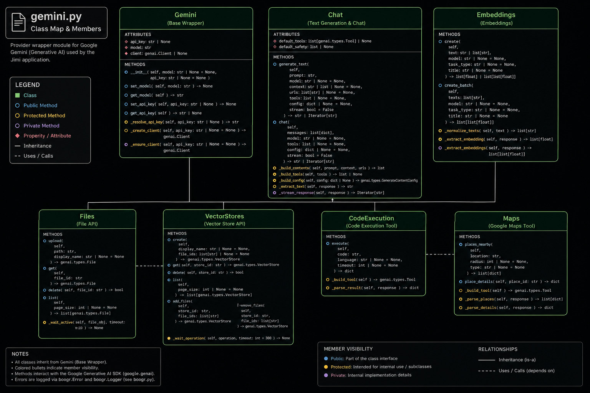

# 🧩 API Reference


___

The Jimi API reference is generated from the project source files using MkDocs, MkDocs Material,
mkdocstrings, and Google-style Python docstrings. These pages document the application entry point,
Gemini provider wrappers, runtime configuration, and SQLite-backed exception logging layer.

The API documentation is intended for developers who need to understand, extend, troubleshoot, or
validate the Jimi codebase.

 
## 📚 API Modules

| Module      | API Page                   | Purpose                                                                                                                  |
| ----------- | -------------------------- | ------------------------------------------------------------------------------------------------------------------------ |
| `app.py`    | [App](app.md)              | Streamlit application entry point, session-state management, workflow routing, UI rendering, and user interaction logic. |
| `gemini.py` | [Gemini](gemini.md)        | Google Gemini wrapper classes for text, images, embeddings, audio, files, and storage workflows.                         |
| `config.py` | [Configuration](config.md) | Runtime constants, environment values, local paths, model settings, logging paths, and validation helpers.               |
| `boogr.py`  | [Logging](boogr.md)        | Structured exception wrapper and SQLite logger used across the application.                                              |

 
## 🧭 How the API Reference Is Built

The API reference is built directly from source comments. Each Python module uses Google-style
docstrings that mkdocstrings can parse into structured documentation.

```text
Python source files
      │
      ▼
Google-style docstrings
      │
      ▼
mkdocstrings
      │
      ▼
MkDocs Material API pages
      │
      ▼
GitHub Pages documentation site
```

This approach keeps the source code and documentation synchronized. When a method signature,
purpose, argument, return value, or exception behavior changes, the corresponding docstring should
be updated in the same change.

## 🧱 Source Modules

### `app.py`

The `app.py` module is the Streamlit application layer. It owns interface construction, page
configuration, sidebar controls, session-state initialization, file upload handling, workflow
routing, result display, and user-facing fallback behavior.

Use the App API page when reviewing:

* Streamlit page setup.
* Session-state defaults.
* Sidebar model and mode controls.
* Chat, document, semantic search, prompt, and data workflows.
* UI helpers and rendering functions.
* Application-level exception logging.
* Recoverable fallback behavior.


### `gemini.py`

The `gemini.py` module is the provider integration layer for Google Gemini and related Google
services. It keeps Google GenAI SDK request construction, configuration, response extraction, file
operations, embeddings, audio workflows, and Google Cloud Storage operations outside the Streamlit
UI.

Primary wrapper classes include:

| Class           | Purpose                                                                                    |
| --------------- | ------------------------------------------------------------------------------------------ |
| `Gemini`        | Base configuration and shared attribute state.                                             |
| `Chat`          | Text generation, structured history, tool use, grounding, and streaming output.            |
| `Images`        | Image generation, image analysis, image editing, image extraction, and grounding metadata. |
| `Embeddings`    | Text embedding generation for semantic search and similarity workflows.                    |
| `TTS`           | Text-to-speech generation and WAV output handling.                                         |
| `Transcription` | Audio-to-text transcription.                                                               |
| `Translation`   | Spoken-language translation from audio files.                                              |
| `Files`         | Gemini file upload, retrieval, listing, deletion, summarization, and search workflows.     |
| `VectorStores`  | Google Cloud Storage-backed collection and object management.                              |


### `config.py`

The `config.py` module centralizes application settings. It keeps runtime paths, model constants,
API key lookups, logging paths, and validation helpers in one place.

Use the Configuration API page when reviewing:

* API key configuration.
* Runtime directories.
* Logging database paths.
* Model constants.
* File-system helpers.
* Input validation helpers.
* Environment-driven defaults.

### `boogr.py`

The `boogr.py` module provides structured exception handling and durable SQLite logging. Application
and provider failures are wrapped in an `Error` object, enriched with module/cause/method metadata,
and written through `Logger`.

Use the Logging API page when reviewing:

* Exception metadata fields.
* SQLite table creation.
* Log-write behavior.
* Traceback capture.
* Application-wide diagnostic pattern.


