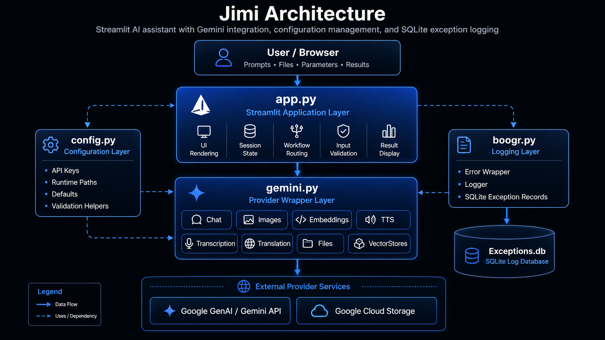

# 🏗️ Architecture


___

Jimi is a Streamlit-based AI assistant application that combines local application state,
configurable model wrappers, Google Gemini services, file processing workflows, semantic search
patterns, SQLite-backed logging, and MkDocs-compatible source documentation. The architecture
separates user-interface orchestration from provider-specific service wrappers so that the
application can expose multiple AI workflows without coupling the Streamlit page directly to every
API implementation detail.

The application is organized around four primary concerns:

1. **User interaction** through `app.py`
2. **Provider integration** through `gemini.py`
3. **Configuration and runtime paths** through `config.py`
4. **Exception capture and durable logging** through `boogr.py`

Together, these modules provide the foundation for text generation, document analysis, image
workflows, embeddings, text-to-speech, transcription, translation, file management, vector-store
style storage, and exception diagnostics.

 

## 🧭 System Overview

At runtime, Jimi starts from the Streamlit application layer. The user selects a workflow, provides
input, uploads files when needed, and configures model parameters through the interface. The
interface then calls one of the wrapper classes responsible for a specific capability.

```text
┌─────────────────────────────────────────────────────────────────────┐
│                            User Browser                             │
│                                                                     │
│  Prompts • Files • Parameters • Buttons • Search • Results          │
└───────────────────────────────┬─────────────────────────────────────┘
                                │
                                ▼
┌─────────────────────────────────────────────────────────────────────-┐
│                              app.py                                  │
│                                                                      │
│  Streamlit UI                                                        │
│  Session State                                                       │
│  Workflow Routing                                                    │
│  Input Validation                                                    │
│  Result Rendering                                                    │
│  Error Display                                                       │
└───────────────┬───────────────────────────────┬─────────────────────-┘
                │                               │
                ▼                               ▼
┌───────────────────────────────┐     ┌───────────────────────────────┐
│          gemini.py            │     │          config.py            │
│                               │     │                               │
│  Chat                         │     │  API Keys                     │
│  Images                       │     │  Runtime Paths                │
│  Embeddings                   │     │  Constants                    │
│  TTS                          │     │  Defaults                     │
│  Transcription                │     │  Validation Helpers           │
│  Translation                  │     │  Logging Paths                │
│  Files                        │     │                               │
│  VectorStores                 │     └───────────────────────────────┘
└───────────────┬───────────────┘
                │
                ▼
┌─────────────────────────────────────────────────────────────────────┐
│                      External Provider Services                     │
│                                                                     │
│  Google GenAI API                                                   │
│  Google Cloud Storage                                               │
│  Gemini File APIs                                                   │
│  Gemini Content Generation                                          │
│  Gemini Embeddings                                                  │
│  Gemini TTS / Audio Understanding                                   │
└───────────────┬─────────────────────────────────────────────────────┘
                │
                ▼
┌─────────────────────────────────────────────────────────────────────┐
│                              boogr.py                               │
│                                                                     │
│  Error Wrapper                                                      │
│  Exception Metadata                                                 │
│  SQLite Logger                                                      │
│  Exceptions Table                                                   │
│  Diagnostic Trace Capture                                           │
└─────────────────────────────────────────────────────────────────────┘
```

 

## 🧱 Core Modules

### `app.py`

The `app.py` module is the main Streamlit entry point. It owns the page configuration, layout,
sidebar controls, workflow selection, session-state initialization, user input handling, result
rendering, and workflow dispatch logic.

Its responsibilities include:

* Initializing and maintaining Streamlit session state.
* Rendering model and mode selectors.
* Capturing prompts, uploaded files, URLs, tool selections, and model parameters.
* Routing user actions to the correct backend wrapper.
* Displaying generated text, image results, audio outputs, search results, status messages, and
  errors.
* Preserving user-facing fallback behavior when optional workflows fail.
* Logging handled exceptions through the shared logging pattern.

The application layer should remain focused on user interaction and orchestration. Provider-specific
API details belong in wrapper modules such as `gemini.py`.

 

### `gemini.py`

The `gemini.py` module contains the Google Gemini integration layer. It exposes capability-specific
wrapper classes that normalize application inputs into Google GenAI SDK calls.

The primary classes are:

| Class           | Responsibility                                                                                        |
| --------------- | ----------------------------------------------------------------------------------------------------- |
| `Gemini`        | Base configuration and shared attribute state for Gemini wrappers.                                    |
| `Chat`          | Text generation, tool-grounded generation, structured history, and multimodal prompt construction.    |
| `Images`        | Image generation, image analysis, image editing, grounding metadata capture, and response extraction. |
| `Embeddings`    | Text embedding generation for semantic search and vector workflows.                                   |
| `TTS`           | Text-to-speech generation using Gemini TTS models.                                                    |
| `Transcription` | Audio transcription through Gemini audio understanding.                                               |
| `Translation`   | Speech translation from audio input into a target language.                                           |
| `Files`         | File upload, retrieval, listing, deletion, summarization, and file-based prompting.                   |
| `VectorStores`  | Google Cloud Storage-backed collection and object management.                                         |

The wrapper design keeps model-specific request construction outside the Streamlit UI. This allows
`app.py` to call high-level methods such as `generate_text`, `generate`, `analyze`, `create`,
`transcribe`, `translate`, `upload`, or `delete` without duplicating SDK configuration logic.

 

### `config.py`

The `config.py` module centralizes runtime configuration. It provides constants, environment-driven
values, local paths, API settings, logging paths, and validation helpers.

Typical configuration responsibilities include:

* API key lookup.
* Model identifiers.
* Application paths.
* Logging database paths.
* SQLite table names.
* Streamlit branding paths.
* Helper functions such as `throw_if`.

The configuration layer allows the rest of the application to avoid hard-coded paths and
credentials. When the environment changes, the configuration can be updated without rewriting the
application logic.

 

### `boogr.py`

The `boogr.py` module provides the shared exception-handling infrastructure.

It typically contains:

| Component | Purpose                                                                                              |
| --------- | ---------------------------------------------------------------------------------------------------- |
| `Error`   | Wraps an exception with structured metadata such as module, cause, method, message, info, and trace. |
| `Logger`  | Writes structured exception records to the configured SQLite database.                               |

This pattern creates a consistent diagnostic trail across the application. Each handled exception
can be associated with the module, class, method, and root cause that produced it.

The standard pattern is:

```python
except Exception as e:
	ex = Error( e )
	ex.module = 'module_name'
	ex.cause = 'ClassOrWorkflow'
	ex.method = 'method_signature'
	Logger( ).write( ex )
	raise ex
```

For fallback handlers that should not crash the Streamlit interface, the same logging pattern is
used, but the original fallback behavior is preserved.

 

## 🔁 Request Flow

A typical text-generation request follows this sequence:

```text
User enters prompt
        │
        ▼
app.py validates prompt and options
        │
        ▼
app.py builds workflow parameters
        │
        ▼
Chat.generate_text(...) is called
        │
        ▼
Chat builds contents and GenerateContentConfig
        │
        ▼
Google GenAI client sends request
        │
        ▼
Gemini returns GenerateContentResponse
        │
        ▼
Chat extracts output text
        │
        ▼
app.py renders response in Streamlit
```

This sequence keeps UI behavior and provider behavior separate. The Streamlit layer does not need to
understand the full GenAI request schema; it only passes normalized values to the wrapper.

 

## 🧠 Text Generation Architecture

Text generation is centered on the `Chat` wrapper. It accepts a prompt and optional model settings,
then constructs the necessary Gemini content payload and generation configuration.

Primary responsibilities include:

* Resolving the active Gemini API key.
* Normalizing tool selections.
* Building conversation history.
* Constructing `GenerateContentConfig`.
* Supporting grounding tools where available.
* Supporting streaming and non-streaming responses.
* Returning clean text output to the UI.

This design supports simple prompting, structured conversations, search-grounded responses, URL
context, code execution, and future tool expansion without forcing those details into the Streamlit
page.

 

## 🖼️ Image Workflow Architecture

Image workflows are handled by the `Images` wrapper. The wrapper supports text-to-image generation,
image analysis, and image editing.

```text
Prompt / Image Path / Model Options
                │
                ▼
        Images wrapper
                │
                ├── Builds image configuration
                ├── Opens local image when needed
                ├── Adds grounding tool when selected
                ├── Sends Gemini request
                ├── Captures grounding metadata
                └── Extracts image or text output
```

The wrapper separates image-specific configuration from the UI. This includes aspect ratio,
resolution, output MIME type, response modality, search grounding, and returned image extraction.

 

## 🔎 Embedding and Semantic Search Architecture

Embeddings are generated through the `Embeddings` wrapper. The application can use embeddings to
support semantic comparison, retrieval workflows, vector-like search, and document similarity.

A typical embedding workflow is:

```text
Text input
   │
   ▼
Embeddings.create(...)
   │
   ▼
Gemini embedding model
   │
   ▼
Vector representation
   │
   ▼
Similarity or retrieval workflow
```

The architecture isolates embedding generation from downstream semantic search behavior. This allows
future vector storage backends to be added without changing the core embedding interface.

 

## 📄 File and Document Architecture

File workflows are split between Streamlit upload handling in `app.py` and Gemini file operations in
`gemini.py`.

The `Files` wrapper supports:

* Uploading local files.
* Retrieving file metadata.
* Listing available remote files.
* Deleting files.
* Summarizing documents.
* Searching document content through file-based prompts.
* Surveying multiple files.

The application can therefore support document Q&A and document summarization without embedding file
API calls directly inside UI callbacks.

 

## 🗂️ Vector Store Architecture

The `VectorStores` wrapper treats Google Cloud Storage buckets as collection backends and blobs as
stored objects. This design gives the application a simple storage abstraction using Google Cloud
Storage primitives.

```text
Collection Name
      │
      ▼
GCS Bucket / Prefix
      │
      ▼
Blob Objects
      │
      ▼
Stored documents, data files, or vector assets
```

The wrapper supports create, upload, retrieve, list, and delete operations. It provides a foundation
for managing reusable data assets and document collections.

 

## 🔊 Audio Architecture

Jimi supports audio-related workflows through dedicated wrappers:

| Wrapper         | Capability                                                          |
| --------------- | ------------------------------------------------------------------- |
| `TTS`           | Converts text to speech and returns WAV bytes or writes a WAV file. |
| `Transcription` | Converts spoken audio into text.                                    |
| `Translation`   | Translates spoken audio into another language.                      |

Each audio workflow follows the same architectural pattern:

```text
User-provided text or audio file
        │
        ▼
app.py captures inputs and options
        │
        ▼
Audio wrapper builds prompt/config
        │
        ▼
Gemini model processes request
        │
        ▼
Text or audio output returns to app.py
```

This keeps audio-specific prompt construction, MIME handling, and response extraction inside the
appropriate wrapper class.

 

## ⚙️ Configuration Flow

Configuration values are resolved through `config.py`. This creates a stable boundary between
runtime environment settings and application logic.

```text
Environment / Local Constants
            │
            ▼
        config.py
            │
            ├── API keys
            ├── model names
            ├── file paths
            ├── database paths
            ├── logging table names
            └── validation helpers
            │
            ▼
 app.py and gemini.py consume settings
```

This approach avoids scattered constants and allows the same codebase to run across local
development, GitHub-hosted documentation, and deployed environments with fewer code changes.

 

## 🧾 Logging and Exception Architecture

Exception handling is centralized around the `Error` and `Logger` classes.

The application uses a consistent exception pattern so that failures contain enough context to
diagnose the module, workflow, and method involved.

```text
Exception raised
      │
      ▼
Error object wraps original exception
      │
      ▼
module / cause / method fields are assigned
      │
      ▼
Logger writes structured record to SQLite
      │
      ▼
Original behavior is preserved:
  - raise for hard failures
  - fallback return for recoverable UI paths
  - continue/pass for non-critical loops
```

This pattern is especially important for Streamlit applications because UI errors can otherwise
disappear into the browser session without durable diagnostics.

 

## 🧩 Documentation Architecture

Jimi’s documentation uses MkDocs Material and mkdocstrings. The source files are documented with
Google-style docstrings so the API reference can be generated directly from the Python modules.

```text
Python source files
      │
      ▼
Google-style docstrings
      │
      ▼
mkdocstrings
      │
      ▼
MkDocs Material pages
      │
      ▼
GitHub Pages documentation site
```

The documentation pipeline depends on consistent docstring structure:

```python
def example_method(value: str) -> str:
	"""
	Purpose:
		Performs a specific application operation using validated input.

	Args:
		value: Input value required by the operation.

	Returns:
		Processed string value.

	Raises:
		Error: Wraps and logs exceptions raised during processing.
	"""
```

This format allows MkDocs and griffe to parse comments reliably.

---

## 🧪 Validation Architecture

The project should be validated at three levels:

### Source validation

```powershell
python -m py_compile .\app.py
python -m py_compile .\boogr.py
python -m py_compile .\config.py
python -m py_compile .\gemini.py
```

### Package validation

```powershell
python -m compileall .
```

### Documentation validation

```powershell
mkdocs build
```

These checks verify syntax, import viability, docstring compatibility, and documentation generation.

 

## 📦 Deployment Architecture

The application and documentation have separate deployment paths.

| Component             | Deployment Target                        |
| --------------------- | ---------------------------------------- |
| Streamlit application | Local runtime or hosted app service      |
| Source repository     | GitHub                                   |
| Documentation site    | GitHub Pages                             |
| API documentation     | MkDocs generated site                    |
| Logs                  | Local SQLite database                    |
| Remote assets         | Gemini Files API or Google Cloud Storage |

The GitHub Pages documentation site is generated from the `docs/` directory and `mkdocs.yml`. The
Streamlit app remains executable from the Python source.

 

## 🔐 Security Considerations

Jimi should keep secrets, tokens, and credentials outside source-controlled code. API keys should be
loaded from environment variables or local configuration that is excluded from the repository.

Recommended practices include:

* Do not commit `.env` files.
* Do not hard-code API keys.
* Keep SQLite logs out of public documentation.
* Avoid logging sensitive prompt content unless explicitly required.
* Keep uploaded files out of source control.
* Use `.gitignore` for runtime artifacts, caches, local databases, and generated outputs.

 

## 🧰 Maintainability Principles

The architecture follows several practical maintainability rules:

1. **UI code should orchestrate, not implement providers.**
   `app.py` should call wrapper methods instead of building provider-specific request payloads
   inline.

2. **Provider wrappers should own provider details.**
   `gemini.py` should own Gemini SDK configuration, request construction, and response extraction.

3. **Configuration should be centralized.**
   Paths, keys, defaults, model names, and logging settings should live in `config.py`.

4. **Exceptions should be logged consistently.**
   Every handled exception should create one `Error` object, write it once with `Logger`, and
   preserve the intended control flow.

5. **Documentation should be generated from source.**
   Google-style docstrings should remain compatible with MkDocs and mkdocstrings.

6. **Fallback behavior should be preserved.**
   Optional UI workflows should log errors without converting recoverable failures into hard
   crashes.

 

## 🧭 Architecture Summary

Jimi is structured as a modular Streamlit application with a clear separation between presentation,
configuration, provider integration, storage, and diagnostics.

The high-level architecture can be summarized as:

```text
Streamlit UI
   │
   ├── Configuration from config.py
   ├── Gemini workflows from gemini.py
   ├── Exception logging through boogr.py
   ├── Local and remote file workflows
   ├── Semantic and embedding workflows
   └── MkDocs documentation generated from source comments
```

This design makes Jimi easier to document, debug, extend, and publish. New models, workflows, pages,
or documentation sections can be added without requiring a full rewrite of the application.
